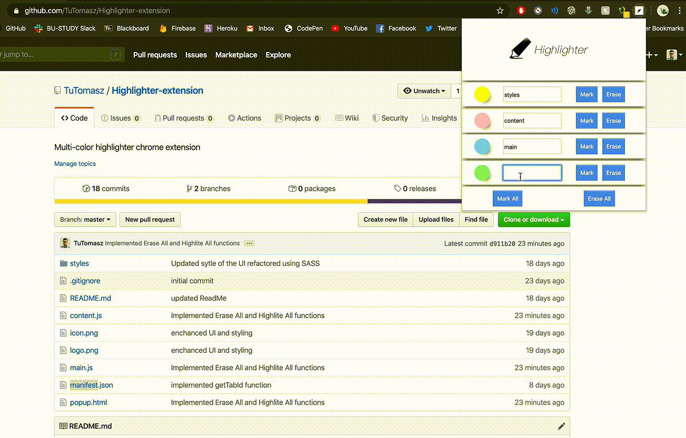

# Highlighter-extension
Multi-color highlighter chrome extension for highlighting text on a website of your choice. The app allows highlighting text in four different colors on any HTML based website.

## Instalation Instructions 

- clone the project repository on your local machine
- In the chrome, settings go to extensions and turn on developer mode
- Click on load unpacked and select the project folder and enjoy

## Application Demo

